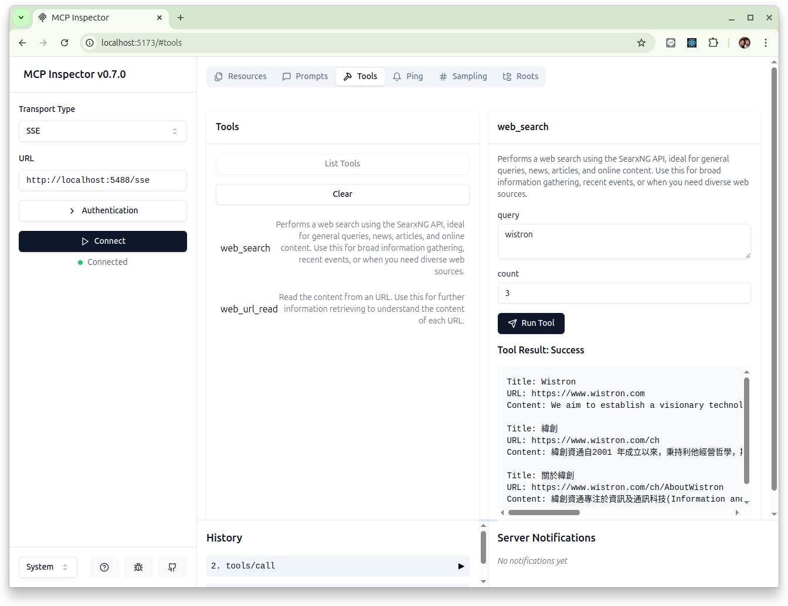
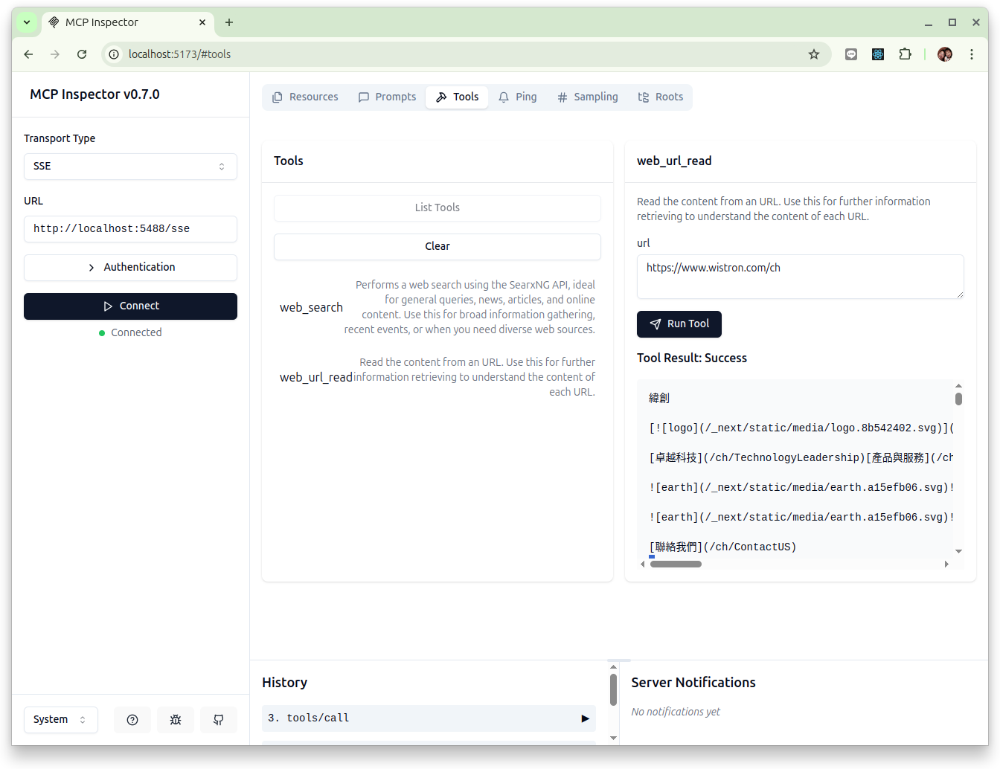

# mcp-searxng

<p align="center">
  <a href="./README.md"></a>
  <a href="./README_TW.md"></a>
</p>

An example of an MCP Server for use by an AI Agent, designed to allow the AI Agent to search for new external information through SearXNG's open-source meta-search engine.

Currently, many search engines other than Google have emerged in the market, attempting to capture market share in areas where Google falls short. For instance, DuckDuckGo emphasizes not tracking users, Ecosia plants trees with every search, and Brave Search aims to harness collective efforts to build a free search engine.

However, the results returned by these engines are often unsatisfactory. Firstly, they don’t crawl as many web pages as Google does; secondly, their support for Chinese is poor. Although they can access some interesting pages that Google doesn’t display, search engines other than Google are still quite difficult to use.

So why not combine the results from multiple search engines!? That’s exactly what a meta-search engine does. SearXNG, an open-source meta-search engine software, can be self-hosted or used via sites provided by enthusiastic community members. For businesses, SearXNG offers a way to maintain privacy and security control while enabling AI Agents to effectively search for the external data they need.

References:  
- [SearXNG Official Website](https://docs.searxng.org/)  
- [Self-Hosting an Open-Source SearXNG Meta-Search Engine to Search Google, DuckDuckGo, and More at Once](https://ivonblog.com/posts/self-hosting-searxng-docker-instance/)

## Purpose

This MCP server demonstrates an SSE-based MCP server (integrated with SearXNG and Microsoft's markdownify to extract web pages into Markdown-formatted text) and its operational mode using the [MCP Inspector](https://modelcontextprotocol.io/docs/tools/inspector) (MCP client).

## Runtime Environment

This project uses [uv](https://docs.astral.sh/uv/) to manage dependencies and the Python runtime environment. If uv is not yet installed, you can follow the installation instructions on the official website.

The following commands are executed in an Ubuntu 24.04 environment. For operations on other operating systems, please adjust accordingly:

```bash
$ curl -LsSf https://astral.sh/uv/install.sh | sh
```

Download source code:

```
$ git clone https://github.com/erhwenkuo/mcp-searxng.git

$ cd mcp-searxng

$ uv sync
```

## Running the Service

### Running the SearXNG Service

First, install Docker on the machine where it will run and perform the related configurations. For detailed information, please refer to: [Install Docker Engine on Ubuntu](https://docs.docker.com/engine/install/ubuntu/)

In the project directory, there is a pre-configured simple SearXNG setup to facilitate testing.

```
mcp-searxng/searxng-docker/
├── docker-compose.yaml
└── searxng
    ├── settings.yml
    └── uwsgi.ini
```

Switch to the `searxng-docker` directory and use Docker Compose to start a SearXNG service:

```bash
$ cd searxng-docker
$ docker compose up -d
$ docker compose ps

NAME      IMAGE                              COMMAND                  SERVICE   CREATED          STATUS                    PORTS
searxng   docker.io/searxng/searxng:latest   "/sbin/tini -- /usr/…"   searxng   29 minutes ago   Up 29 minutes (healthy)   0.0.0.0:8888->8080
```

The test SearXNG service is mapped to the local machine's `port: 8888`.

### Starting the MCP-SEARXNG Service

#### Method 1. Using uv to start:

Enter the following command to start:

```bash
$ uv run server.py --searxng_url="http://localhost:8888"

INFO:     Started server process [219904]
INFO:     Waiting for application startup.
INFO:     Application startup complete.
INFO:     Uvicorn running on http://0.0.0.0:5488 (Press CTRL+C to quit)
```

### Using Docker to Start

First, build the Docker image:

```bash
$ docker build -t mcp-searxng .
```

Start mcp-searxng. Since the mcp-searxng service is being started using Docker, you cannot use `localhost` to point to the SearXNG service address when configuring the connection to SearXNG. It is recommended to directly query the local machine's IP address and then use the `SEARXNG_URL` environment variable for configuration.

The startup parameters below assume the local machine's IP is `192.168.54.88`:

```bash
$ docker run -d -e SEARXNG_URL="http://192.168.54.88:8888" -p 5488:5488 mcp-searxng
```

## Verifying the Results

First, install Node.js:

```bash
# Download and install nvm:
curl -o- https://raw.githubusercontent.com/nvm-sh/nvm/v0.40.2/install.sh | bash

# In lieu of restarting the shell
\. "$HOME/.nvm/nvm.sh"

# Download and install Node.js:
nvm install 22

# Verify the Node.js version:
node -v # Should print "v22.14.0".
nvm current # Should print "v22.14.0".

# Verify npm version:
npm -v # Should print "10.9.2".
```

Next, start the [MCP Inspector](https://github.com/modelcontextprotocol/inspector):

```bash
$ npx @modelcontextprotocol/inspector

Starting MCP inspector...
Proxy server listening on port 3000

🔍 MCP Inspector is up and running at http://localhost:5173 🚀
```

Open `http://localhost:5173` in your browser and perform the following actions:

1. Select `SSE` in the Transport Type dropdown.
2. Enter the MCP server's address and port in the URL field: `http://localhost:5488/sse`.
3. Click `Connect`. If the status shows "Connected," it means you have successfully connected to the MCP server.
4. Click the "Tools" tab at the top.
5. Click the "List Tools" button, and you should see two tools:
    - `web_search`
    - `web_url_read`
6. Click `web_search`. On the right, you’ll see the tool’s description and parameters. Enter the keyword you want to search for in the `query` input field, then click the "Run Tool" button.

The effect is shown in the image below:



Test `web_url_read`:

- Click `web_url_read`. On the right, you’ll see the tool’s description and parameters. Enter the URL of the webpage you want to retrieve in the `url` input field, then click the "Run Tool" button.



## Why Use SSE

This means the MCP server can be a process running remotely, and the AI Agent (client) can connect, use, and disconnect from it anytime, anywhere. In other words, an SSE-based server and client can be decoupled processes (potentially even on decoupled nodes).

Compared to the STDIO-based model, where the client spawns the server as a subprocess, this is different and more suitable for "cloud-native" use cases.

### MCP Server

`server.py` is an SSE-based MCP server. By default, the server runs on `0.0.0.0:5488`, but it can be configured using command-line arguments, for example:

```bash
uv run server.py --host <your host> --port <your port>
```

Startup Parameters:

| Parameter        | Required | Default             | Type | Description             |
|------------------|----------|---------------------|------|-------------------------|
| `--host`         | No       | `0.0.0.0`          | str  | Host to bind to         |
| `--port`         | No       | `5488`             | int  | Port to listen on       |
| `--searxng_url`  | No       | `http://localhost:8888` | str  | SearXNG URL to connect to |

